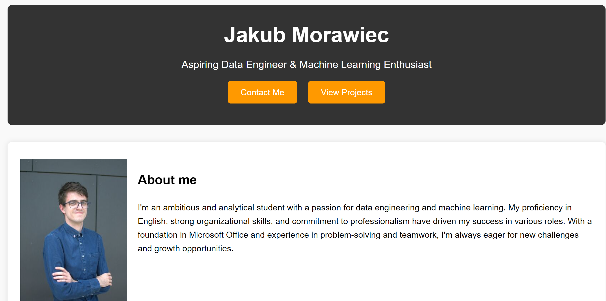

# Jakub Morawiec's Portfolio

Welcome to my personal portfolio website! This repository contains the code for my static website showcasing my skills, projects, and experience. The website is built with HTML and CSS and is hosted on GitHub Pages.



## Table of Contents

- [About](#about)
- [Features](#features)
- [Getting Started](#getting-started)

## About

I'm Jakub Morawiec, an aspiring Data Engineer and Machine Learning enthusiast. This portfolio highlights my journey, skills, and the projects I am most proud of. I have a passion for data engineering, and I enjoy solving complex problems and learning new technologies.

## Features

- **About Me**: An overview of my background and interests.
- **Experience**: A timeline of my work experience and key roles.
- **Projects**: A showcase of my significant projects, with descriptions and technologies used.
- **Skills**: A display of my technical skills and tools I am proficient with.
- **Contact**: Links to get in touch with me via email, LinkedIn, and GitHub.

## Getting Started

To get a local copy up and running, follow these simple steps.

### Prerequisites

You only need a web browser to view the website.

### Installation

1. Clone the repo
   ```sh
   git clone https://github.com/jmorawiecpwr/portfolio.git
